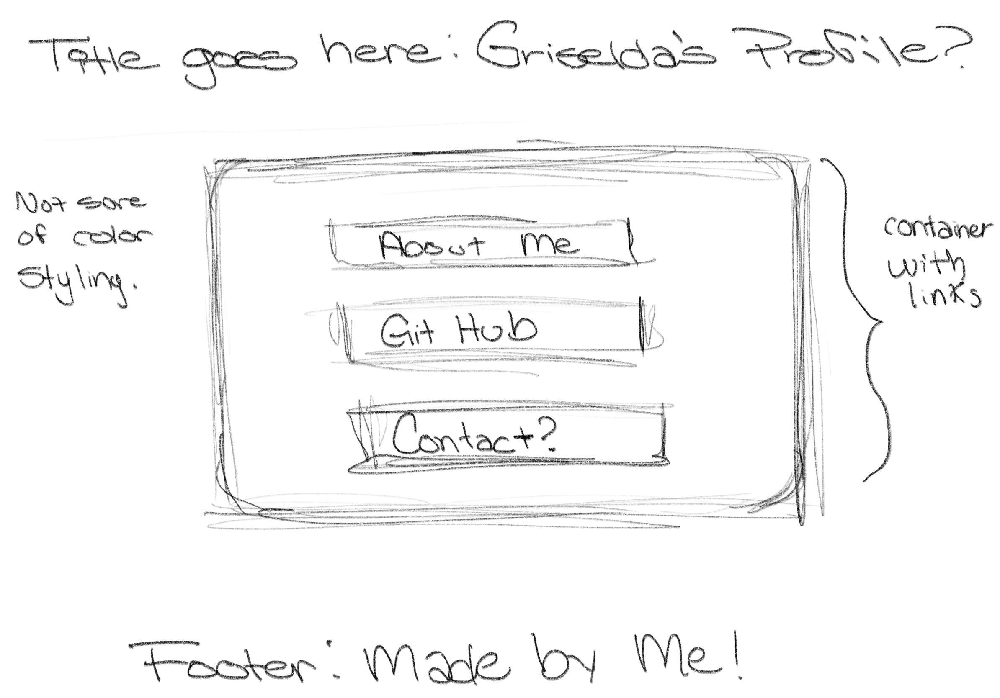
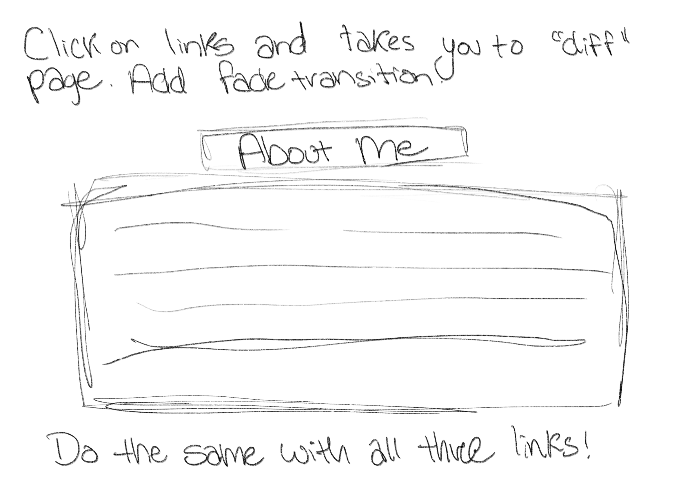

# Updated-Portfolio

# Summary: 
For this week's assignment, we were asked to update our portfolios in order to be employer ready, along with our portfolios, we were also asked to update our LinkedIn's and our GitHubs to make them look more professional. 
For our updated porfolios, we had to include:
* Our contact information
* Links to our GitHub and our LinkedIn
* Display two examples of student projects or homeworks 
* And for the portfolio / website to be mobile friendly:

The final result was this: 

# Coming up with a Plan: 
Before getting started, I came up with a few rough sketches of what I wanted to do for my portfolio. I wanted something that was a lot better than my last portfolio, but something simple that would show my projects, my github, my linkedin, as well as some about me info. 
I know these sketches arent the best, but like I mentioned before, they are called ROUGH sketches for a reason.

After I came up with a plan, it was time to get started. 

# Getting Started:
For me, having a rough idea planned out on paper was probably one of the best decisions I could of made, before, I had absolutely no idea where I wanted to get started, or even how. 

* Working with the HTML:
Starting with the HTML, one of the first things that I created where notes to myself of what I wanted and where I wanted it, for example, I knew I wanted a title, a section where my buttons / links would go, as well as my footer, so in the HTML, I would write "This is where the About Me section would go" or "This is where the buttons will go". From there, I began to create each part of my website just a little bit at a time. With the help of a few coding websites, I learned how to make things work as well as how to change things up a bit in the HTML.

* Working with the CSS: 
When I began to work with the CSS, that's where my mind went blank, I had absolutely no idea how I wanted to style my portfolio. 
I would ask myself: What were the colors gonna be? Do I want something fancy or simple? What even is an example of a good styled website? Just a bunch of questions in my mind but no answers, styling isnt by best skill but as you can see, but I made it work using a lot of google searches for inspiration.

There's a website called 'carrd.co' where people can go and create their own porfolios by picking whatever template they'd like to start from, then they can change the colors or add a background photo. I was looking through the templates and saw one that I liked and decided to model my portfolio from that. I know it's not the most creative approach, but I seriously cannot style a website to save my life, guess now I know where I need the practice.

* Working with the JavaScript:
I didn't mess with the JavaScript because I didn't want my website to do a whole lot of stuff. By the time I started working on this, I decided to keep it simple, and as long as everything worked fine, I was happy. I used a website to teach me how to do the slide-overlay transition where my projects were going to be displayed. I didn't want them just to be all crammed into one page, so I figured I would place my projects in another "page".

# Final Thoughts:
I know this portfolio doesn't seem like much, but to me it was one of the funnest things I've gotten to make in this class. Being able to freely do what you want really opened up my mind to new possibilities and I only would like to improve my portfolio from here. One of the things that I would really like to work on is styling, I feel like that's one of my biggest obstacles in web-design so far. 

# Final Product / Screenshots:

# Resources Used:
* Font Awesome: For the heart icon
* W3Schools : 
    - How to make rounded borders
    - How to create a sliding overlay
    - How to create buttons that acted like links

* Tools used to make the porfolio include:
    - HTML
    - CSS
    - JAVASCRIPT
